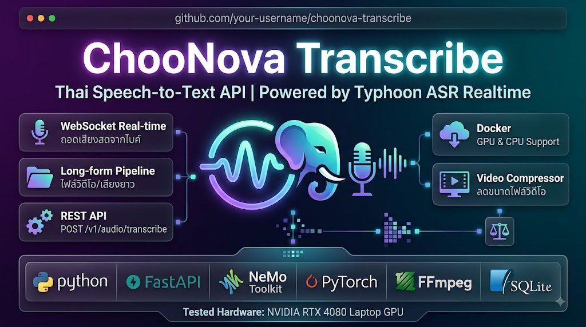

# ChooNova Transcribe — Thai Speech-to-Text API

<p align="center">
  
</p>

Speech-to-Text API บริการภาษาไทย powered by **Typhoon ASR Realtime** (FastConformer-Transducer 114M parameters) บน **Python 3.12 + FastAPI + NeMo Toolkit** รองรับทั้ง GPU (NVIDIA, CUDA 12.1) และ CPU (Windows, Mac M1–M4, Linux) — ทดสอบบน **Notebook NVIDIA RTX 4080 Laptop GPU 12GB VRAM**

> 🤖 โปรเจกต์นี้พัฒนาขึ้นด้วยความช่วยเหลือของ **DeepSeek V4 Flash Model** (AI Pair Programmer)

> 💡 **For AI Coding Agents:** หากต้องการคำแนะนำการตั้งค่า คำสั่งติดตั้ง และสถาปัตยกรรมโปรเจกต์โดยละเอียด โปรดอ่าน [project-onboarding SKILL.md](file://.agents/skills/project-onboarding/SKILL.md) ก่อนดำเนินการ

## Modes

1. **REST API** (`POST /v1/audio/transcribe`) — ถอดความไฟล์เสียงสั้น multipart upload
2. **WebSocket Real-time** (`/v1/realtime/stream`) — ถอดเสียงสดจากไมค์ chunk 250ms
3. **Long-form Pipeline** (`POST /v1/media/transcribe/jobs`) — ไฟล์วิดีโอ/เสียงยาวสูงสุด 1GB+ แบบ async
4. **ประวัติการถอดความ** (`/media/transcribe/jobs/history`) — ดู/export/ลบ งานที่เคยถอดความไว้
5. **Video Compressor** (`POST /v1/media/compress/jobs`) — ลดขนาดไฟล์วิดีโอด้วย FFmpeg แบบ async คิว 1 ไฟล์ต่อครั้ง (ลดความละเอียด / บิตเรต / ตัดหัว-ท้าย `start`/`end`)
6. **Compressor History** (`/media/compress/jobs/history`) — ดูผลการบีบอัด และลบไฟล์ผลลัพธ์ด้วยตนเองเพื่อประหยัดพื้นที่
7. **Settings** (`/setting`) — จัดการ API Key และตั้งค่าโมเดล VRAM (always / idle)

## Tech Stack

| Layer            | Technology                                                     |
| ---------------- | -------------------------------------------------------------- |
| Language         | Python 3.12                                                    |
| Web Framework    | FastAPI + Uvicorn                                              |
| ASR Model        | NeMo Toolkit ≥2.0, Typhoon ASR Realtime (`.nemo`)              |
| Deep Learning    | PyTorch 2.5.1 (CUDA 12.1 / CPU)                                |
| Tested Hardware  | Notebook NVIDIA RTX 4080 Laptop GPU (12GB VRAM)                |
| Audio Processing | FFmpeg, librosa, soundfile                                     |
| Storage          | SQLite (jobs history), filesystem (temp jobs)                  |
| Frontend         | Vanilla HTML/CSS/JS + Jinja2 templates (glassmorphism dark UI) |

## Directory Structure

```
├── app/
│   ├── main.py          # FastAPI app, route registration, WebSocket, periodic cleanup + idle reaper
│   ├── config.py        # Environment configuration & defaults
│   ├── auth.py          # API key verification (x-api-key)
│   ├── db.py            # SQLite repository for jobs + runtime settings + retention cleanup
│   ├── schemas.py       # Pydantic request/response models
│   ├── asr_engine.py    # Typhoon ASR model singleton wrapper (NeMo) with idle-unload
│   ├── whisper_engine.py # faster-whisper engine (English / Thai-English mixed) with idle-unload
│   ├── engine_router.py # Language dispatcher (th -> Typhoon, en/auto -> Whisper)
│   ├── audio_utils.py   # FFmpeg extract/split, disk-space check, safe_delete helpers
│   ├── job_worker.py    # Async long-form transcription pipeline (chunking + GPU loop)
│   ├── run_job.py       # Subprocess entrypoint for isolated job workers
│   ├── compress_utils.py # FFmpeg probe / command builder / progress parser (video compressor)
│   ├── compress_worker.py # Async video compression worker (FFmpeg, progress -> DB)
│   ├── run_compress_job.py # Subprocess entrypoint for isolated compressor workers
│   ├── templates/       # HTML pages (index, upload, realtime, media, jobs, compress, setting)
│   └── static/          # CSS + JS (upload.js, realtime.js, media.js, jobs.js, model_status.js, settings.js)
├── data/                # SQLite DB (choonova-transcribe.db) — optional, baked empty into Docker image
├── model/               # Model weights (typhoon-asr-realtime.nemo, git-ignored)
├── Dockerfile           # GPU image (CUDA 12.1, PyTorch)
├── Dockerfile.cpu       # CPU-only image (also works on Mac M1–M4)
├── docker-compose.yml   # GPU compose (requires NVIDIA Docker + km4u-network)
├── docker-compose-km4u.yml # GPU compose standalone (no external network)
├── docker-compose-cpu.yml  # CPU compose (Windows / Mac / Linux CPU)
├── requirements.txt     # GPU dependencies (CUDA 12.1 PyTorch index)
├── requirements-cpu.txt # CPU dependencies
├── .env.example         # Environment template
└── README.md            # Documentation & project manual
```

## Quick Start

### Docker (Recommended)

```bash
# GPU (requires NVIDIA Docker + CUDA)
docker compose up -d --build

# CPU (Windows / Mac M1–M4 / Linux)
docker compose -f docker-compose-cpu.yml up -d --build
```

Service runs on `http://localhost:8830/`

**หมายเหตุเรื่องฐานข้อมูล:** image มี SQLite `choonova-transcribe.db` ว่างๆ ฝังไว้ในตัวแล้ว (baked) — รันโดยไม่ mount ก็ใช้งานได้ทันที เหมาะสำหรับ export/แจกจ่าย image ส่วนข้อมูลประวัติงานจะอยู่ใน container (หายเมื่อลบ container) ถ้าต้องการเก็บข้อมูลข้าม container ให้เปิดคอมเมนต์ volume `./data:/app/data` ใน docker-compose ไฟล์นั้นๆ

### Local Development

```bash
# GPU
pip install -r requirements.txt
uvicorn app.main:app --host 0.0.0.0 --port 8830

# CPU
pip install -r requirements-cpu.txt
DEVICE=cpu uvicorn app.main:app --host 0.0.0.0 --port 8830
```

## Environment Variables

| Variable                    | Default                           | Description                                                                                                               |
| --------------------------- | --------------------------------- | ------------------------------------------------------------------------------------------------------------------------- |
| `HOST`                      | `0.0.0.0`                         | Bind address                                                                                                              |
| `PORT`                      | `8830`                            | Service port                                                                                                              |
| `GATEWAY_API_KEY`           | `change-me-in-production`         | API key (set in production)                                                                                               |
| `MODEL_PATH`                | `model/typhoon-asr-realtime.nemo` | Local model path (fallback: HuggingFace)                                                                                  |
| `DEVICE`                    | `cuda`                            | `cuda` / `cpu` (auto-detect if CUDA unavailable)                                                                          |
| `WHISPER_MODEL`             | `medium`                          | faster-whisper size: `tiny/base/small/medium/large-v3`                                                                    |
| `LOG_LEVEL`                 | `info`                            | Logging level                                                                                                             |
| `DATA_DIR`                  | `<project>/data`                  | SQLite directory                                                                                                          |
| `TEMP_JOBS_DIR`             | `/tmp/choonova-transcribe-jobs`   | Temp job directory                                                                                                        |
| `MIN_FREE_DISK_GB`          | `5.0`                             | Min disk space before rejecting uploads                                                                                   |
| `MAX_UPLOAD_SIZE_MB`        | `0`                               | Max upload size for long-form media jobs (MB); `0` = unlimited                                                            |
| `MAX_AUDIO_UPLOAD_SIZE_MB`  | `50.0`                            | Max upload size for short audio endpoint (MB); always enforced (> 0)                                                      |
| `TARGET_CHUNK_DURATION_SEC` | `30.0`                            | Target chunk duration for silence-aware splitting                                                                         |
| `MAX_CHUNK_DURATION_SEC`    | `60.0`                            | Max chunk duration (hard cut fallback)                                                                                    |
| `CLEANUP_RETENTION_HOURS`   | `24`                              | Job retention before periodic cleanup                                                                                     |
| `PYTORCH_CUDA_ALLOC_CONF`   | `expandable_segments:True`        | PyTorch CUDA allocator config                                                                                             |
| `MODEL_LOAD_MODE`           | `always`                          | Model VRAM residency mode: `always` / `idle` (seed value only, see below)                                                 |
| `MODEL_IDLE_TIMEOUT_SEC`    | `900`                             | Seconds of inactivity before unloading models in `idle` mode (seed value only)                                            |
| `COMPRESS_ENCODER`          | `libx264`                         | Video compressor encoder: `libx264` (software) / `nvenc` (GPU NVENC; auto-falls back to `libx264` if unusable at runtime) |
| `COMPRESS_PRESET`           | `medium`                          | Default x264 preset (ultrafast..veryslow)                                                                                 |
| `COMPRESS_CRF`              | `28`                              | Default encoder quality (1-51; higher = smaller)                                                                          |
| `COMPRESS_MAX_CONCURRENT`   | `1`                               | Max videos compressed at once (1 = strict queue)                                                                          |
| `COMPRESS_MAX_QUEUED`       | `10`                              | Max jobs in queue before new uploads rejected (429)                                                                       |
| `COMPRESS_RETENTION_HOURS`  | `24`                              | Retention for compressed output files on disk                                                                             |

Copy `.env.example` to `.env` to customize.

## Model VRAM Residency Mode

The service can control how long the ASR models (Typhoon + Whisper) stay loaded in GPU memory:

- **`always` (default)** — models stay resident in VRAM once loaded (warm). Original behavior.
- **`idle`** — models are unloaded from VRAM after `MODEL_IDLE_TIMEOUT_SEC` of inactivity, then reload on demand (first request after idle pays a cold-start cost of ~10–60s).

The mode and idle timeout are stored in the SQLite `settings` table. On **first boot** the values are seeded from the environment (`MODEL_LOAD_MODE` / `MODEL_IDLE_TIMEOUT_SEC`). After that the **DB is the source of truth** — you can change the mode at runtime without restarting:

- **Settings page** (`/setting`): \"ตั้งค่าโมเดลบน VRAM\" card — select mode + idle timeout, save.
- **API**: `GET` / `PUT /v1/settings/model` (auth required).

Every page header shows a live status badge: 🟢 model on VRAM / 🟡 loading / ⚪ idle (unloaded), plus the active mode — and pages show "กำลังโหลดโมเดลขึ้น VRAM..." progress when a cold load is triggered.

> 💡 **Docker note:** with the default compose (DB volume not mounted), the settings DB lives inside the container — any mode change made via the UI is lost when the container is recreated, and the mode resets to the `.env` default. Enable `./data:/app/data` in docker-compose to persist the DB (and job history) across restarts.

## API

| Method | Path                                                     | Auth | Description                                                |
| ------ | -------------------------------------------------------- | ---- | ---------------------------------------------------------- |
| GET    | `/`                                                      | —    | Dashboard home                                             |
| GET    | `/audio/transcribe`                                      | —    | Audio file transcribe page                                 |
| GET    | `/realtime/stream`                                       | —    | Real-time mic stream page                                  |
| GET    | `/media/transcribe`                                      | —    | Long-form video/audio transcribe                           |
| GET    | `/media/compress`                                        | —    | Video compressor page                                      |
| GET    | `/media/compress/jobs/history`                           | —    | Compressor history page (ดูผล + ลบไฟล์ output ด้วยตนเอง)   |
| GET    | `/media/transcribe/jobs/history`                         | —    | Transcription history page (เดิม `/jobs/history` redirect) |
| GET    | `/setting`                                               | —    | Settings page (API Key + VRAM mode)                        |
| GET    | `/healthz`                                               | —    | Health check (+ model state / mode)                        |
| GET    | `/v1/settings/model`                                     | ✅   | Get model VRAM mode + engine states                        |
| PUT    | `/v1/settings/model`                                     | ✅   | Change model VRAM mode at runtime                          |
| POST   | `/v1/audio/transcribe`                                   | ✅   | Transcribe audio file                                      |
| POST   | `/v1/media/transcribe/jobs`                              | ✅   | Create long-form job (202, async)                          |
| GET    | `/v1/media/transcribe/jobs`                              | ✅   | List jobs                                                  |
| GET    | `/v1/media/transcribe/jobs/{id}`                         | ✅   | Job status + result                                        |
| DELETE | `/v1/media/transcribe/jobs/{id}`                         | ✅   | Delete job (record + media)                                |
| DELETE | `/v1/media/transcribe/jobs/{id}/media`                   | ✅   | Delete media only (keep record)                            |
| GET    | `/v1/media/transcribe/jobs/{id}/export/{txt\|srt\|json}` | ✅   | Export result                                              |
| POST   | `/v1/media/compress/jobs`                                | ✅   | Create video compress job (202, async queue)               |
| GET    | `/v1/media/compress/jobs`                                | ✅   | List compress jobs                                         |
| GET    | `/v1/media/compress/jobs/{id}`                           | ✅   | Compress job status + result                               |
| GET    | `/v1/media/compress/jobs/{id}/download`                  | ✅   | Download compressed MP4                                    |
| DELETE | `/v1/media/compress/jobs/{id}`                           | ✅   | Cancel/delete compress job (input + output)                |
| DELETE | `/v1/media/compress/jobs/{id}/output`                    | ✅   | Delete output file ONLY (keep history record)              |
| WS     | `/v1/realtime/stream`                                    | —    | Real-time streaming                                        |

### cURL Examples

```bash
# Transcribe audio file (Thai - default via Typhoon ASR)
curl -X POST http://localhost:8830/v1/audio/transcribe \
  -H "x-api-key: change-me-in-production" \
  -F "file=@audio.mp3" -F "language=th" -F "with_timestamps=true"

# Transcribe English / Thai-English mixed audio via Whisper
curl -X POST http://localhost:8830/v1/audio/transcribe \
  -H "x-api-key: change-me-in-production" \
  -F "file=@english.mp3" -F "language=en"

# Transcribe with auto language detection (Whisper)
curl -X POST http://localhost:8830/v1/audio/transcribe \
  -H "x-api-key: change-me-in-production" \
  -F "file=@mixed.mp3" -F "language=auto"

# Long-form job (Thai - default)
curl -X POST http://localhost:8830/v1/media/transcribe/jobs \
  -H "x-api-key: change-me-in-production" \
  -F "file=@video.mp4"

# Long-form job with English / mixed audio
curl -X POST http://localhost:8830/v1/media/transcribe/jobs \
  -H "x-api-key: change-me-in-production" \
  -F "file=@video.mp4" -F "language=th"

# Long-form job with custom chunk settings (optional; defaults 30/60s from env)
curl -X POST http://localhost:8830/v1/media/transcribe/jobs \
  -H "x-api-key: change-me-in-production" \
  -F "file=@video.mp4" -F "target_chunk_sec=45" -F "max_chunk_sec=90"

# Check status
curl http://localhost:8830/v1/media/transcribe/jobs/<JOB_ID> \
  -H "x-api-key: change-me-in-production"

# Export SRT
curl http://localhost:8830/v1/media/transcribe/jobs/<JOB_ID>/export/srt \
  -H "x-api-key: change-me-in-production" -o subtitle.srt

# Create video compression job (reduce width to 1280 + cap bitrate to 2000kbps)
curl -X POST http://localhost:8830/v1/media/compress/jobs \
  -H "x-api-key: change-me-in-production" \
  -F "file=@video.mp4" -F "target_width=1280" -F "bitrate_kbps=2000"

# Same, but cut the head/tail first: keep only 01:00 - 02:00 (start/end accept SS, MM:SS or HH:MM:SS; empty = no trim)
curl -X POST http://localhost:8830/v1/media/compress/jobs \
  -H "x-api-key: change-me-in-production" \
  -F "file=@video.mp4" -F "target_width=1280" -F "bitrate_kbps=2000" \
  -F "start=00:01:00" -F "end=00:02:00"

# Check compression status (includes queue position)
curl http://localhost:8830/v1/media/compress/jobs/<JOB_ID> \
  -H "x-api-key: change-me-in-production"

# Download the compressed MP4
curl http://localhost:8830/v1/media/compress/jobs/<JOB_ID>/download \
  -H "x-api-key: change-me-in-production" -o compressed.mp4

# Switch model to 'idle' mode (unload VRAM after 10 min of inactivity)
curl -X PUT http://localhost:8830/v1/settings/model \
  -H "x-api-key: change-me-in-production" \
  -H "Content-Type: application/json" \
  -d '{"mode":"idle","idle_timeout_sec":600}'
```

`language` รับค่าได้ 3 แบบ:

- `th` (default) — ใช้ Typhoon ASR Realtime (ภาษาไทย, **เร็วกว่า Whisper มาก** เหมาะกับ real-time)
- `en` — ใช้ faster-whisper (อังกฤษ, output คำอังกฤษเป็นตัวละติน)
- `auto` — ใช้ faster-whisper ตรวจจับภาษาอัตโนมัติ (รองรับภาษาไทย/อังกฤษผสม หรือ code-switching)

`target_chunk_sec` / `max_chunk_sec` (ไม่บังคับ) — กำหนดช่วงความยาวต่อ chunk ในการตัดแบ่งตามช่วงเงียบ (ค่า default จาก env `TARGET_CHUNK_DURATION_SEC`=30 และ `MAX_CHUNK_DURATION_SEC`=60) ต้องผ่านเงื่อนไข `0 < target_chunk_sec <= max_chunk_sec`; ค่าที่ใช้จริงจะถูกบันทึกในตาราง `jobs` (คอลัมน์ `target_chunk_sec`, `max_chunk_sec`) และโผล่ใน response ของ job status

> ⚠️ WebSocket `/v1/realtime/stream` (real-time ไมค์) รองรับเฉพาะภาษาไทย (Typhoon) อย่างเดียว — คำอังกฤษในเสียงไทยจะออกเป็นทับศัพท์ตัวไทย โมเดล Whisper ที่โหลดครั้งแรกจะดาวน์โหลดอัตโนมัติจาก HuggingFace (config: `WHISPER_MODEL`, default `medium`)

### WebSocket

```javascript
const ws = new WebSocket(`ws://localhost:8830/v1/realtime/stream`);
// Send audio chunks + text commands: "INTERIM", "COMMIT_SEGMENT", "CLEAR"
ws.send(audioBlob);
ws.send("COMMIT_SEGMENT");
```

## Long-form Pipeline Flow

```
POST /v1/media/transcribe/jobs  (multipart, 1GB+)
        │ 202 Accepted → job_id
        ▼
job_worker.py (isolated subprocess)
  ├─ 1. FFmpeg extract → 16kHz mono 16-bit WAV
  ├─ 2. Silence-aware chunking (target 30s, max 60s, overlap 0.25s)
  ├─ 3. GPU transcription loop (global asyncio.Lock)
  │      → delete each chunk WAV after inference
  ├─ 4. Build full text + timestamps + SRT
  └─ 5. Save to SQLite → cleanup temp files
```

- Media files deleted automatically after processing (text/SRT/timestamps preserved in SQLite)
- CUDA resilience: transient error retry (backoff) + allocator corruption recovery (cudaDeviceReset)
- Worker crash watchdog: detects subprocess death and marks jobs as failed

## Video Compressor Flow

```
POST /v1/media/compress/jobs  (multipart; target_width / bitrate_kbps / crf / preset / start / end)
        │ 202 Accepted → job_id + queue_position
        ▼
compress_queue_dispatcher (FIFO, COMPRESS_MAX_CONCURRENT=1 → ทำทีละ 1 ไฟล์)
        ▼
run_compress_job.py (isolated subprocess)
  ├─ 1. ffprobe → ความละเอียด / ความยาว / มีเสียงไหม
  ├─ 2. สร้างคำสั่ง FFmpeg (scale คงอัตราส่วน, bitrate/CRF, encoder libx264|nvenc)
  │      → progress % อัปเดตลง SQLite ทุก ~1 วิ (-progress pipe:1)
  │      → ถ้า nvenc เปิด encoder ไม่ได้ที่ runtime (missing libnvidia-encode.so.1 / driver เก่า)
  │        ระบบ auto-fallback เป็น libx264 และบันทึก encoder จริงที่ใช้ลง DB อัตโนมัติ
  ├─ 3. ตรวจ output → บันทึก output_path / ขนาด / ความละเอียด ลง SQLite
  └─ 4. ลบไฟล์ต้นฉบับทุกกรณี (สำเร็จ/ล้มเหลว/ยกเลิก/restart) — output เก็บตาม COMPRESS_RETENTION_HOURS
```

- **ลด dimension คงอัตราส่วน**: `-vf scale=<width>:-2` (ค่า `-2` รักษาสัดส่วน + จำนวนคู่; ระบบห้ามขยายเกินไฟล์ต้นฉบับ)
- **ตัดหัว/ท้าย (trim)**: `start`/`end` รับค่าเป็น `SS`, `MM:SS` หรือ `HH:MM:SS` (ว่าง = ไม่ตัด, default) — FFmpeg ใช้ `-ss <start> -to <end>` แบบ input option (fast seek + frame-accurate ตอน re-encode) เพื่อตัดเฉพาะช่วง `[start, end]`; ถ้าระบุแค่ `start` → ตัดหัว แล้วเก็บไปจนจบ, ระบุแค่ `end` → เก็บตั้งแต่ต้นถึง `end`
- **ลด bitrate**: `-b:v Nk -maxrate Nk -bufsize 2Nk` (หรือใช้ CRF `-crf` ถ้าไม่ได้ระบุ)
- **Encoder**: `libx264` (default, ใช้ได้ทุกที่) หรือ `h264_nvenc` (GPU เร็วมาก ถ้า ffmpeg build รองรับ — เปลี่ยนผ่าน env `COMPRESS_ENCODER`). ถ้าเลือก `nvenc` แล้ว runtime ใช้ไม่ได้ (เช่น ไม่มี `libnvidia-encode.so.1` ในคอนเทนเนอร์ หรือ driver เก่า) → ระบบ fallback เป็น `libx264` อัตโนมัติ + บันทึก encoder จริงที่ใช้ใน DB. **ใน Docker ต้องตั้ง env `NVIDIA_DRIVER_CAPABILITIES=video,compute,utility`** (ใน docker-compose.yml / docker-compose-km4u.yml แล้ว) ถึงจะ inject library NVENC เข้าไปในคอนเทนเนอร์ได้
- **คิว**: รองรับพร้อมกันสูงสุด `COMPRESS_MAX_CONCURRENT` (default 1 = เข้มงวด 1 ไฟล์ต่อครั้ง), อัปโหลดเกิน `COMPRESS_MAX_QUEUED` → HTTP 429
- ไฟล์ output จะถูกลบจากดิสก์อัตโนมัติหลัง `COMPRESS_RETENTION_HOURS` (default 24 ชม.) แต่ record ยังอยู่ใน DB
- วิดีโอที่ไม่มีเสียง → FFmpeg ใช้ `-an` อัตโนมัติ
- Output เป็น MP4 (H.264 + AAC 128k) เสมอ เข้ากันได้ทุกอุปกรณ์

## ตรวจสอบ NVIDIA GPU / NVENC

ตรวจ driver และ GPU บน Windows host (ต้องเห็น **NVIDIA-SMI ≥ 530.41.03** และชื่อ GPU ถูกต้อง):

```
nvidia-smi
```

```text
Tue Aug 11 12:08:45 2026
+-----------------------------------------------------------------------------------------+
| NVIDIA-SMI 610.88                 KMD Version: 610.88        CUDA UMD Version: 13.3     |
+-----------------------------------------+------------------------+----------------------+
| GPU  Name                  Driver-Model | Bus-Id          Disp.A | Volatile Uncorr. ECC |
| Fan  Temp   Perf          Pwr:Usage/Cap |           Memory-Usage | GPU-Util  Compute M. |
|                                         |                        |               MIG M. |
|=========================================+========================+======================|
|   0  NVIDIA GeForce RTX 4080 ...  WDDM  |   00000000:01:00.0  On |                  N/A |
| N/A   47C    P0             21W /  120W |    2007MiB /  12282MiB |      3%      Default |
|                                         |                        |                  N/A |
+-----------------------------------------+------------------------+----------------------+
```

ตรวจว่า GPU ถูก inject เข้า Docker container (ควรเห็น **Persistence-M: On** และชื่อ GPU เหมือน host):

```
docker run --rm --gpus all nvidia/cuda:12.0.0-base-ubuntu22.04 nvidia-smi
```

```text
Tue Aug 11 05:09:05 2026
+-----------------------------------------------------------------------------------------+
| NVIDIA-SMI 610.57.01              KMD Version: 610.88        CUDA UMD Version: 13.3     |
+-----------------------------------------+------------------------+----------------------+
| GPU  Name                 Persistence-M | Bus-Id          Disp.A | Volatile Uncorr. ECC |
| Fan  Temp   Perf          Pwr:Usage/Cap |           Memory-Usage | GPU-Util  Compute M. |
|                                         |                        |               MIG M. |
|=========================================+========================+======================|
|   0  NVIDIA GeForce RTX 4080 ...    On  |   00000000:01:00.0  On |                  N/A |
| N/A   46C    P8              4W /  120W |    2000MiB /  12282MiB |     19%      Default |
|                                         |                        |                  N/A |
+-----------------------------------------+------------------------+----------------------+
```

ตรวจว่า NVENC library ถูก mount เข้า container (ต้องเห็น `libnvidia-encode.so.1` + `libnvcuvid.so.1`) และ encode ได้จริง:

```
docker exec <container> ls /usr/lib/x86_64-linux-gnu/ | grep -E 'libnvidia-encode|libnvcuvid'
docker exec <container> ffmpeg -h encoder=h264_nvenc >/dev/null && echo "h264_nvenc OK"
docker exec <container> ffmpeg -hide_banner -y -f lavfi -i testsrc=size=320x240:rate=30:duration=1 -frames:v 2 -c:v h264_nvenc -f null - && echo "NVENC encode OK"
```

ถ้าเจอ error `Cannot load libnvidia-encode.so.1` → ตั้ง `NVIDIA_DRIVER_CAPABILITIES=video,compute,utility` ใน `docker-compose.yml` / `docker-compose-km4u.yml` แล้ว `docker compose up -d` — หรือระบบจะ fallback เป็น `libx264` อัตโนมัติ

## Testing

No formal test suite. Manual verification via:

- Dashboard: `http://localhost:8830/`
- Syntax check: `python -m py_compile app/main.py app/db.py app/config.py app/audio_utils.py app/asr_engine.py app/whisper_engine.py app/engine_router.py app/schemas.py app/job_worker.py`
- cURL examples above

## Model

Model weights auto-downloaded from `typhoon-ai/typhoon-asr-realtime` on HuggingFace during Docker build. Local file: `model/typhoon-asr-realtime.nemo` (git-ignored, ~1GB VRAM at FP16).

สำหรับภาษาไทย Typhoon ASR Realtime **เร็วกว่า Whisper อย่างมีนัยสำคัญ** โดยเฉพาะบน GPU — เหมาะกับงาน real-time และถอดไฟล์เสียงยาว
