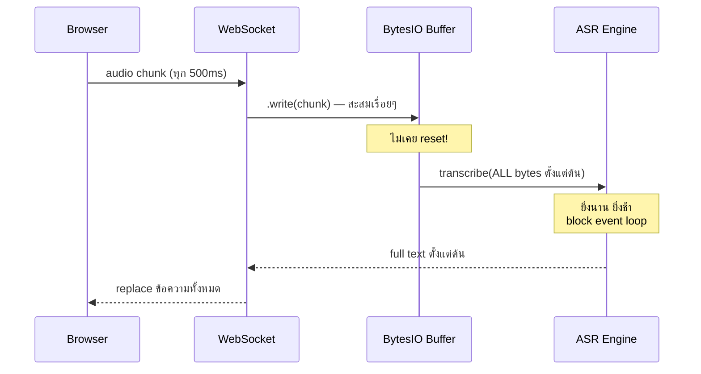
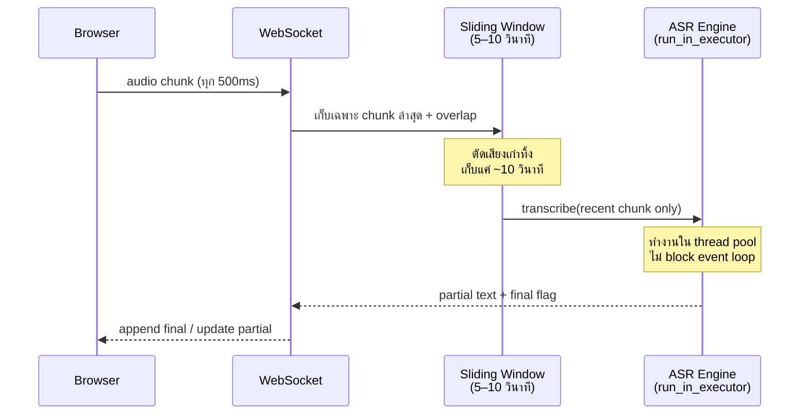

# 🐛 Bug Report: Realtime ASR Streaming — ประสิทธิภาพลดลงตามเวลา

| Field | Detail |
|---|---|
| **Service** | `typhoon-asr-service` |
| **Page** | `/test/realtime` |
| **Severity** | 🔴 Critical — ฟีเจอร์หลักใช้งานจริงไม่ได้เมื่อพูดนานเกิน ~30 วินาที |
| **Status** | Open |
| **Reported** | 2026-08-05 |

---

## อาการที่พบ (Symptom)

เมื่อเข้าหน้า `/test/realtime` กดปุ่มไมโครโฟนเพื่อเริ่มพูด:

- **ช่วง 0–15 วินาทีแรก** — ข้อความปรากฏใน Live Transcript เร็ว ตอบสนองดี ✅
- **ช่วง 15–30 วินาที** — เริ่มมีดีเลย์ ข้อความมาช้าลงเรื่อยๆ ⚠️
- **หลัง 30 วินาที** — ข้อความหายไปนาน แล้วพิมพ์มาทีเดียวเยอะมาก ตามไม่ทันคำพูด 🔥
- **หลัง 1–2 นาที** — แทบจะหยุดตอบสนอง เสมือนค้าง 💀

> [!IMPORTANT]
> อาการนี้เป็น **progressive degradation** — ยิ่งพูดนานยิ่งช้า ไม่มีทาง recover ได้โดยไม่กดหยุดแล้วเริ่มใหม่

---

## สาเหตุราก (Root Cause Analysis)

พบ **4 จุดบกพร่อง** ที่ทำงานร่วมกันจนเกิดปัญหา:

---

### Bug #1: 🔴 Audio Buffer สะสมไม่มีที่สิ้นสุด — ไม่เคย Reset

> **ไฟล์**: [`main.py`](file:///d:/_PROJECT_/choonova-ai/services/typhoon-asr-service/app/main.py) บรรทัด 127–154

```python
# main.py L131
audio_buffer = io.BytesIO()          # สร้างครั้งเดียวตอนเริ่ม connection

while True:
    data = await websocket.receive_bytes()
    audio_buffer.write(data)          # ← เขียนเพิ่มเรื่อยๆ ไม่เคยลบ
    current_bytes = audio_buffer.getvalue()  # ← ดึงข้อมูลทั้งหมดตั้งแต่ต้นจนปัจจุบัน

    if len(current_bytes) > 10240:    # เกิน 10KB ก็ transcribe
        res = engine.transcribe_bytes(current_bytes, ...)
        # ❌ ไม่มี audio_buffer.seek(0) หรือ audio_buffer.truncate(0) เลย
```

**ผลกระทบ**: ทุกครั้งที่ transcribe จะประมวลผลเสียง **ตั้งแต่วินาทีแรกจนถึงปัจจุบัน**

| เวลาที่พูด | ขนาด Buffer ที่ส่ง transcribe | เวลาประมวลผลโดยประมาณ |
|---|---|---|
| 5 วินาที | ~80 KB | < 1 วินาที ✅ |
| 30 วินาที | ~480 KB | ~3–5 วินาที ⚠️ |
| 1 นาที | ~960 KB | ~8–15 วินาที 🔥 |
| 5 นาที | ~4.8 MB | ~60+ วินาที 💀 |

> [!CAUTION]
> Buffer โตแบบ **linear** แต่เวลา transcribe โตแบบ **super-linear** (โมเดล FastConformer Transducer มี attention mechanism ที่ช้าลงเมื่อ sequence ยาวขึ้น) ทำให้ปัญหาเร่งตัวขึ้นเรื่อยๆ

---

### Bug #2: 🔴 Transcribe เป็น Synchronous Blocking — ค้าง Event Loop

> **ไฟล์**: [`main.py`](file:///d:/_PROJECT_/choonova-ai/services/typhoon-asr-service/app/main.py) บรรทัด 146

```python
# ภายใน async function websocket_stream
res = engine.transcribe_bytes(current_bytes, filename_hint="stream.webm")
#     ^^^^^^^^^^^^^^^^^^^^^^^^^^^^^^^^^^^
#     CPU-intensive synchronous call ภายใน async context!
```

`engine.transcribe_bytes()` เป็น synchronous function ที่ทำงานหนัก (เขียนไฟล์ temp, resample, load audio, inference) แต่ถูกเรียกตรงๆ ใน async WebSocket handler **โดยไม่ผ่าน `run_in_executor()`**

**ผลกระทบ**:
- Block uvicorn event loop ทั้งหมดระหว่าง transcribe
- WebSocket ไม่สามารถรับ audio chunk ใหม่ได้ → chunk สะสมใน OS socket buffer
- ถ้ามีหลาย client เชื่อมต่อพร้อมกัน ทุกคนจะช้าหมด

---

### Bug #3: 🟡 ไม่มี Sliding Window — ส่ง Full Audio ทุกรอบ

> **ไฟล์**: [`main.py`](file:///d:/_PROJECT_/choonova-ai/services/typhoon-asr-service/app/main.py) บรรทัด 141–146

ระบบปัจจุบันไม่มีแนวคิด "window" เลย — ทุกรอบ transcribe จะส่งเสียงทั้งหมด ทั้งๆ ที่สำหรับ real-time streaming ควรส่งเฉพาะ **chunk ล่าสุด** (เช่น 5–10 วินาที) พร้อม overlap เล็กน้อยเพื่อไม่ให้คำถูกตัดกลาง

**เปรียบเทียบกับตัวอย่างจากผู้พัฒนา**: ไฟล์ [`typhoon_asr_inference.py`](file:///d:/_PROJECT_/choonova-ai/services/typhoon-asr-service/example_code/typhoon-asr-main/typhoon_asr_inference.py) ของ SCB-10X ออกแบบเป็น **batch inference** (ใส่ไฟล์ทั้งไฟล์ → ได้ผล) ไม่ได้ออกแบบมาสำหรับ streaming — โค้ดปัจจุบันนำ batch pattern มาใช้ใน streaming context ผิดวิธี

---

### Bug #4: 🟡 Frontend แทนที่ข้อความทั้งหมดแทน Append

> **ไฟล์**: [`realtime.js`](file:///d:/_PROJECT_/choonova-ai/services/typhoon-asr-service/app/static/js/realtime.js) บรรทัด 323–331

```javascript
socket.onmessage = (event) => {
    const data = JSON.parse(event.data);
    if (data.text) {
        liveTranscript.textContent = data.text;  // ← แทนที่ทั้งหมด ไม่ใช่ต่อท้าย
    }
};
```

เมื่อ backend ส่ง full transcription ของเสียง 2 นาทีกลับมา frontend จะ **ลบข้อความเก่าทั้งหมดแล้วใส่ใหม่** ทำให้เกิดอาการ:
- ข้อความหายหมด → รอนาน → ข้อความปรากฏทีเดียวเยอะ
- ข้อความกระพริบ (flicker) ทุกครั้งที่ได้ผลลัพธ์ใหม่

> [!NOTE]
> ในสถาปัตยกรรมที่ถูกต้อง backend ควรส่งกลับมาเป็น 2 แบบ:
> - `partial` — ข้อความ chunk ปัจจุบัน (ยังไม่ final, อาจเปลี่ยน)
> - `final` — ข้อความที่ confirm แล้ว (append ได้เลย)
>
> แล้ว frontend ก็ append เฉพาะ `final` ต่อท้ายข้อเก่า และแสดง `partial` เป็นข้อความสีจางอยู่ท้ายสุด

---

## Data Flow Diagram — ปัจจุบัน vs. ที่ควรจะเป็น

### ❌ สถาปัตยกรรมปัจจุบัน (มีปัญหา)



### ✅ สถาปัตยกรรมที่ควรจะเป็น



---

## ไฟล์ที่เกี่ยวข้อง

| ไฟล์ | บทบาท | มี Bug |
|---|---|---|
| [`main.py`](file:///d:/_PROJECT_/choonova-ai/services/typhoon-asr-service/app/main.py) | FastAPI + WebSocket endpoint | ✅ Bug #1, #2, #3 |
| [`asr_engine.py`](file:///d:/_PROJECT_/choonova-ai/services/typhoon-asr-service/app/asr_engine.py) | ASR inference engine (NeMo) | ❌ ไม่มี bug แต่ต้องเพิ่ม method สำหรับ streaming |
| [`realtime.js`](file:///d:/_PROJECT_/choonova-ai/services/typhoon-asr-service/app/static/js/realtime.js) | Frontend WebSocket client + UI | ✅ Bug #4 |
| [`realtime.html`](file:///d:/_PROJECT_/choonova-ai/services/typhoon-asr-service/app/templates/realtime.html) | HTML template | ❌ ไม่มี bug |

---

## แนวทางแก้ไขที่แนะนำ

### 1. Backend — Reset Buffer หลัง Transcribe (แก้ Bug #1)
- หลัง transcribe สำเร็จ ต้อง `audio_buffer = io.BytesIO()` หรือ `.seek(0); .truncate(0)`
- เก็บเฉพาะ overlap ~1–2 วินาทีสุดท้ายไว้เป็น context ต่อเนื่อง

### 2. Backend — ใช้ `asyncio.get_event_loop().run_in_executor()` (แก้ Bug #2)
- ย้าย `engine.transcribe_bytes()` ไปรันใน thread pool เพื่อไม่ block event loop
- WebSocket ยังรับ chunk ใหม่ได้ระหว่าง transcribe

### 3. Backend — Sliding Window Architecture (แก้ Bug #3)
- กำหนด window size (เช่น 5–10 วินาที)
- ส่ง transcribe เฉพาะ window ปัจจุบัน
- แยก response เป็น `partial` (กำลังฟัง) และ `final` (ยืนยันแล้ว)

### 4. Frontend — Append Logic (แก้ Bug #4)
- `final` → append ต่อท้ายข้อความเดิม
- `partial` → แสดงเป็นข้อความชั่วคราว (สีจาง) ที่ท้ายสุด จะถูกแทนที่เมื่อได้ final

---

## การ Reproduce

1. เปิด `http://localhost:8830/test/realtime`
2. กดปุ่มไมค์เพื่อเริ่มบันทึก
3. พูดต่อเนื่องไม่หยุด
4. สังเกตว่า **หลัง 15–30 วินาที** ข้อความเริ่มมาช้าลง และ delay เพิ่มขึ้นเรื่อยๆ
5. หลัง 1 นาที ข้อความจะหายไปนานแล้วปรากฏมาทีเดียวเป็นก้อนใหญ่
