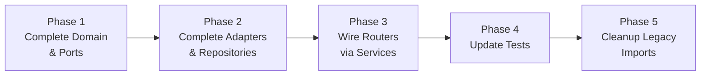

# Migration Plan: Wire Transcription & Compression Routers Through Hexagonal Architecture

## ผลการตรวจสอบ (Audit Findings)

### Claim Verification: ✅ ถูกต้องเกือบทั้งหมด (มีรายละเอียดเพิ่มเติม + พบ bug เพิ่ม)

Claims ที่ส่งมาถูกต้องในสาระสำคัญ — **routers ทั้ง transcription และ compression ยังใช้ legacy code โดยตรง ไม่ผ่าน module ใหม่** ส่วนรายละเอียดปลีกย่อยที่ต่างจาก claim:

| Claim | ผลตรวจจริง |
|---|---|
| `app/db.py` เป็น shim 28 บรรทัด | ❌ **เป็น full implementation 800 บรรทัด** (AGENTS.md ระบุ `app/db.py` เป็น shim ซึ่งผิด — เฉพาะ `app/config.py` กับ `app/auth.py` เท่านั้นที่เป็น shim) |
| `app/run_job.py` เรียก legacy ตรง | ❌ **`app/run_job.py` เป็น shim 6 บรรทัด** ที่ forward ไปหา `app.modules.transcription.adapters.inbound.workers.run_job.main()` อยู่แล้ว (เช่นเดียวกับ `app/run_compress_job.py`) |
| Dead code ~438 บรรทัด | 🟡 จำนวนบรรทัดจริงรวม ~663 บรรทัด (claim นับน้อยไป เพราะบางไฟล์มีบรรทัดมากกว่าที่ระบุ) |
| `sqlite_job_repository.py` column names ตรง DB schema | ❌ **Repository ใช้ชื่อ column ผิด** เช่น `progress_pct`, `current_stage`, `timestamps_json` ซึ่งไม่ตรงกับ schema จริงใน `app/db.py` (`progress`, `stage`, `result_json`) — ถ้าเรียกจะ error |
| `ffmpeg_audio_adapter.py` imports ถูกต้อง | ❌ **Import function names ผิด** — adapter import `extract_audio_from_media`, `split_audio_into_chunks`, `get_media_duration` ซึ่ง **ไม่มีอยู่จริง** ใน `audio_utils.py` (ชื่อจริงคือ `extract_audio_ffmpeg`, `split_audio_silence`, `get_audio_duration_ffmpeg`) |
| Workers เป็น wrapper ที่ forward ไป legacy | ✅ ถูกต้อง — แต่ workers เหล่านี้ **ถูกเรียกจริง** ผ่าน shim (`app/run_job.py` → module worker → legacy `process_transcription_job`) |

### สถานะ Migration ปัจจุบัน

```
                    ROUTER (FastAPI)         MODULE (Hexagonal)        LEGACY (app/*.py)
                    ─────────────────        ──────────────────        ─────────────────
Transcription   →  import app.db ✗          entities/ports 🟡          app/db.py (800L)
                    import app.engine_*      adapters orphaned 🔴      app/job_worker.py (423L)
                    import app.audio_*       service partial 🟡        app/engine_router.py (154L)
                    import app.job_worker    tests exist ✅            app/audio_utils.py (228L)

Compression     →  import app.db ✗          entities/ports 🟡          app/compress_utils.py (331L)
                    import app.compress_*    adapters orphaned 🔴      app/compress_worker.py (295L)
                                             service partial 🟡

Settings        →  ✅ wired correctly       ✅ fully migrated          N/A
```

### Module Completeness Gap Analysis

**Transcription Module Gaps:**
- Entity missing: `file_path`, `duration`, `chunk_settings`, `chunks_done`, `chunks_total`, `engine_used`, `processing_time_sec`
- Port missing: `update_job_progress`, `update_job`, `job_queue_info`, `get_retention_summary`, `count_queued`, `cleanup_old`
- `update_status` signature incomplete (missing `chunks_done`, `chunks_total`, `engine_used`, `processing_time_sec`)
- Repository missing state transition validation (`VALID_TRANSITIONS`)

**Compression Module Gaps:**
- Entity missing: `bitrate_kbps`, `crf`, `preset`, `original_size`, `compressed_size`, `file_path`, `processing_time_sec`, `audio_extract_format`
- Port missing: `update_job`, `queue_info`, `retention_summary`, `count_queued`, `cleanup_old`
- FFmpeg adapter has semantic mismatch (port returns `CompressResult`, legacy returns `None` and updates DB directly)

---

## User Review Required

> [!IMPORTANT]
> **Breaking Change: `views_router.py` (Web Dashboard)**
> `app/api/web/views_router.py` ก็ import จาก `app.db` เช่นกัน (4 functions). Plan นี้จะ migrate `views_router.py` ให้ใช้ services ด้วย เพื่อไม่ให้มี caller ค้างอยู่กับ legacy

> [!IMPORTANT]
> **`realtime_router.py` (WebSocket) — ไม่ migrate**
> ตาม architecture skill ระบุชัดเจนว่า WebSocket Real-time ให้ใช้ fast-path ตรง ไม่ต้องผ่าน domain entity mapping ทุก chunk ดังนั้น `realtime_router.py` จะยังคง import `app.engine_router` ตรงเหมือนเดิม

> [!IMPORTANT]
> **`app/engine_router.py` — ยังคงเป็น shared infrastructure**
> `engine_router.py` ถูกใช้โดย `realtime_router.py`, `main.py` (healthcheck), `views_router.py`, `settings_router.py` (unload). จะไม่ลบไฟล์นี้ แต่ transcription module จะ wrap มันผ่าน adapter (ซึ่งมีอยู่แล้วและถูกต้อง)

> [!WARNING]
> **Legacy workers (`job_worker.py`, `compress_worker.py`) จะยังคงอยู่ในเฟสนี้**
> Workers เป็น subprocess ที่ lazy-import PyTorch/NeMo — การ refactor internal ของ workers เป็น scope ใหญ่มากและเสี่ยง (GPU memory management, CUDA resilience, async locks). Plan นี้จะ wire **routers → services → ports** แต่ worker adapters จะยังคง delegate ไปหา legacy workers (ซึ่งเป็น valid adapter pattern — wrap infrastructure)

> [!CAUTION]
> **`app/db.py` (800 บรรทัด) — จะค่อยๆ ลดบทบาท ไม่ลบทันที**
> `app/db.py` มี functions ที่ถูกใช้จากหลาย callers. หลัง migration, routers จะไม่ import จาก `app/db` อีก แต่ legacy workers (`job_worker.py`, `compress_worker.py`) จะยังใช้ `app.db` ภายในตัวเอง. `app/db.py` จะกลายเป็น internal ของ worker layer เท่านั้น

---

## Open Questions

> [!IMPORTANT]
> **Q1: มี API consumers ภายนอกที่ depend on response shape หรือไม่?**
> ถ้า response JSON structure เปลี่ยน (เช่น field names ต่าง) อาจ break clients. Plan นี้จะรักษา response format เดิมทุกประการโดยใช้ dict conversion ใน router layer

> [!IMPORTANT]
> **Q2: ต้องการ migration แบบ incremental (ทำทีละ module) หรือ big bang?**
> Plan นี้เสนอแบบ **incremental**: Transcription ก่อน → test → Compression → test → cleanup. ถ้าต้องการ big bang โปรดแจ้ง

---

## Proposed Changes

### Overview: 5 Phases



---

### Phase 1: Complete Domain Layer (Entities + Ports)

#### [MODIFY] [entities.py](file:///d:/_PROJECT_/choonova-transcribe/app/modules/transcription/domain/entities.py)
เพิ่ม fields ที่ขาดให้ตรง legacy:
```diff
 @dataclass
 class TranscriptionJob:
     id: str
     filename: str
     language: str
     status: str = "queued"
+    file_path: Optional[str] = None
+    duration: Optional[float] = None
+    chunk_settings: Optional[dict] = None
+    chunks_done: Optional[int] = None
+    chunks_total: Optional[int] = None
+    engine_used: Optional[str] = None
+    processing_time_sec: Optional[float] = None
     created_at: Optional[str] = None
     completed_at: Optional[str] = None
     result_text: Optional[str] = None
     result_srt: Optional[str] = None
     error: Optional[str] = None
```

#### [MODIFY] [ports.py](file:///d:/_PROJECT_/choonova-transcribe/app/modules/transcription/domain/ports.py)
เพิ่ม methods ที่ขาด ให้ `JobRepositoryPort`:
```diff
+    @abstractmethod
+    def update_job_progress(self, job_id: str, chunks_done: int) -> bool: ...
+    @abstractmethod
+    def update_job(self, job_id: str, **kwargs) -> bool: ...
+    @abstractmethod
+    def job_queue_info(self) -> dict: ...
+    @abstractmethod
+    def get_retention_summary(self) -> dict: ...
+    @abstractmethod
+    def count_queued(self) -> int: ...
+    @abstractmethod
+    def cleanup_old(self) -> int: ...
```
อัพเดต `update_status` ให้รับ params เพิ่ม: `chunks_done`, `chunks_total`, `engine_used`, `processing_time_sec`

---

#### [MODIFY] [entities.py](file:///d:/_PROJECT_/choonova-transcribe/app/modules/compression/domain/entities.py)
เพิ่ม fields ที่ขาด:
```diff
 @dataclass
 class CompressionJob:
     id: str
     filename: str
     encoder: str
     status: str = "queued"
+    file_path: Optional[str] = None
+    bitrate_kbps: Optional[int] = None
+    crf: Optional[int] = None
+    preset: Optional[str] = None
+    original_size: Optional[int] = None
+    compressed_size: Optional[int] = None
+    processing_time_sec: Optional[float] = None
+    audio_extract_format: Optional[str] = None
     quality: Optional[str] = None
     target_width: Optional[int] = None
     ...
```

#### [MODIFY] [ports.py](file:///d:/_PROJECT_/choonova-transcribe/app/modules/compression/domain/ports.py)
เพิ่ม methods ที่ขาดให้ `CompressionRepositoryPort`:
```diff
+    @abstractmethod
+    def update_job(self, job_id: str, **kwargs) -> bool: ...
+    @abstractmethod
+    def queue_info(self) -> dict: ...
+    @abstractmethod
+    def get_retention_summary(self) -> dict: ...
+    @abstractmethod
+    def count_queued(self) -> int: ...
+    @abstractmethod
+    def cleanup_old(self) -> int: ...
```

---

### Phase 2: Complete Adapters (Repositories + Media)

#### [MODIFY] [sqlite_job_repository.py](file:///d:/_PROJECT_/choonova-transcribe/app/modules/transcription/adapters/outbound/repositories/sqlite_job_repository.py)
- เพิ่ม 6 methods ที่ขาด: `update_job_progress`, `update_job`, `job_queue_info`, `get_retention_summary`, `count_queued`, `cleanup_old`
- อัพเดต `create` ให้รับ entity ที่มี fields ใหม่
- อัพเดต `update_status` ให้รับ params เพิ่ม
- เพิ่ม state transition validation (port จาก `VALID_TRANSITIONS` ใน `app/db.py`)
- **Implementation**: delegate ไปหา `app.core.db.get_db_connection()` ด้วย SQL ที่ port มาจาก `app/db.py` โดยตรง

#### [MODIFY] [sqlite_compress_repository.py](file:///d:/_PROJECT_/choonova-transcribe/app/modules/compression/adapters/outbound/repositories/sqlite_compress_repository.py)
- เพิ่ม 5 methods ที่ขาด: `update_job`, `queue_info`, `get_retention_summary`, `count_queued`, `cleanup_old`
- อัพเดต `create` ให้รองรับ entity fields ใหม่
- เพิ่ม state transition validation

#### Engine adapters — ไม่ต้องแก้ไข (ถูกต้องแล้ว)
- [engine_router.py](file:///d:/_PROJECT_/choonova-transcribe/app/modules/transcription/adapters/outbound/engines/engine_router.py) ✅
- [typhoon_adapter.py](file:///d:/_PROJECT_/choonova-transcribe/app/modules/transcription/adapters/outbound/engines/typhoon_adapter.py) ✅
- [whisper_adapter.py](file:///d:/_PROJECT_/choonova-transcribe/app/modules/transcription/adapters/outbound/engines/whisper_adapter.py) ✅

#### [MODIFY] [ffmpeg_audio_adapter.py](file:///d:/_PROJECT_/choonova-transcribe/app/modules/transcription/adapters/outbound/media/ffmpeg_audio_adapter.py)
- 🔴 **แก้ broken imports**: เปลี่ยน `extract_audio_from_media` → `extract_audio_ffmpeg`, `split_audio_into_chunks` → `split_audio_silence`, `get_media_duration` → `get_audio_duration_ffmpeg`
- เพิ่ม `allowed_file` method (ถูกใช้ใน transcription_router)

#### [MODIFY] [ffmpeg_adapter.py](file:///d:/_PROJECT_/choonova-transcribe/app/modules/compression/adapters/outbound/ffmpeg_adapter.py)
- แก้ semantic mismatch: adapter ไม่ควร call `process_compress_job` ตรง (legacy function updates DB directly). แทนที่ adapter จะ delegate compression logic ผ่าน `app.compress_utils.build_compress_cmd` แล้ว return `CompressResult`
- หรือ simplify: ให้ adapter เป็น thin wrapper ที่ call legacy `compress_utils` functions (ไม่รวม DB update) แล้ว return result

---

### Phase 3: Wire Routers via Services (Core Migration)

#### [MODIFY] [transcription_service.py](file:///d:/_PROJECT_/choonova-transcribe/app/modules/transcription/application/transcription_service.py)
เพิ่ม methods ที่ขาด:
- `create_job` — expanded signature ให้ตรง legacy
- `update_job_progress`
- `update_job`
- `job_queue_info`
- `get_retention_summary`
- `count_queued`
- `cleanup_old`
- `build_srt_subtitles` — static/utility method (ย้ายมาจาก `job_worker.py`)

#### [MODIFY] [transcription_router.py](file:///d:/_PROJECT_/choonova-transcribe/app/api/v1/transcription_router.py)
**นี่คือ core change สำคัญที่สุด:**

```diff
-from app.engine_router import normalize_language, transcribe_bytes as router_transcribe_bytes
-from app.audio_utils import check_disk_space, safe_delete_dir
-from app.db import create_job, get_job, list_jobs, delete_job, update_job_status
+from app.modules.transcription.adapters.outbound.repositories.sqlite_job_repository import SQLiteJobRepository
+from app.modules.transcription.application.transcription_service import TranscriptionService
+from app.modules.transcription.adapters.outbound.engines.engine_router import ModuleEngineRouter
+from app.modules.transcription.adapters.outbound.media.ffmpeg_audio_adapter import FFmpegAudioAdapter
+
+def get_transcription_service() -> TranscriptionService:
+    repo = SQLiteJobRepository()
+    engine = ModuleEngineRouter()
+    media = FFmpegAudioAdapter()
+    return TranscriptionService(repo, engine, media)
```

- ทุก endpoint function เปลี่ยนจาก call `app.db.*` ตรง → `service.*`
- Response format คงเดิม (entity → dict conversion ใน router layer)
- Lazy import `build_srt_subtitles` เปลี่ยนเป็น call จาก service

---

#### [MODIFY] [compression_service.py](file:///d:/_PROJECT_/choonova-transcribe/app/modules/compression/application/compression_service.py)
เพิ่ม methods ที่ขาด:
- Expanded `create_job` signature
- `update_job`
- `queue_info`
- `get_retention_summary`
- `count_queued`
- `cleanup_old`
- `normalize_encoder`, `parse_trim_time` — utility methods (ย้ายจาก `compress_utils.py`)

#### [MODIFY] [compression_router.py](file:///d:/_PROJECT_/choonova-transcribe/app/api/v1/compression_router.py)
```diff
-from app.compress_utils import normalize_encoder, parse_trim_time
-from app.db import (
-    create_compress_job, get_compress_job, list_compress_jobs, ...
-)
+from app.modules.compression.adapters.outbound.repositories.sqlite_compress_repository import SQLiteCompressRepository
+from app.modules.compression.application.compression_service import CompressionService
+
+def get_compression_service() -> CompressionService:
+    repo = SQLiteCompressRepository()
+    return CompressionService(repo)
```

---

#### [MODIFY] [views_router.py](file:///d:/_PROJECT_/choonova-transcribe/app/api/web/views_router.py)
```diff
-from app.db import list_jobs, get_job, list_compress_jobs, get_compress_job
+from app.modules.transcription.application.transcription_service import TranscriptionService
+from app.modules.compression.application.compression_service import CompressionService
 # ... wire via get_*_service() pattern
```

---

### Phase 4: Update Tests

#### [MODIFY] [test_transcription_service.py](file:///d:/_PROJECT_/choonova-transcribe/tests/unit/transcription/test_transcription_service.py)
- Update `FakeJobRepository` ให้ implement methods ใหม่ทั้งหมด
- เพิ่ม test cases สำหรับ `create_job` ด้วย expanded fields
- เพิ่ม test cases สำหรับ `update_job_progress`, `job_queue_info`, `count_queued`
- เพิ่ม test สำหรับ `build_srt_subtitles`

#### [MODIFY] [test_compression_service.py](file:///d:/_PROJECT_/choonova-transcribe/tests/unit/compression/test_compression_service.py)
- Update `FakeCompressionRepository` ให้ implement methods ใหม่
- เพิ่ม test cases สำหรับ expanded fields
- เพิ่ม test cases สำหรับ `queue_info`, `count_queued`

---

### Phase 5: Cleanup

#### Legacy files — สถานะหลัง migration

| File | Action | Reason |
|---|---|---|
| `app/db.py` | **KEEP** (mark as internal) | ยังถูกใช้โดย `job_worker.py`, `compress_worker.py` ภายใน subprocess workers. เพิ่ม docstring warning ว่า "Internal — used by legacy workers only" |
| `app/job_worker.py` | **KEEP** | ถูกเรียกจาก worker adapter — valid infrastructure wrapper |
| `app/compress_worker.py` | **KEEP** | เดียวกัน |
| `app/engine_router.py` | **KEEP** | ถูกใช้โดย `realtime_router.py`, `main.py`, and wrapped by module adapter |
| `app/audio_utils.py` | **KEEP** | ถูก wrapped by module adapter; `job_worker.py` ก็ใช้ |
| `app/compress_utils.py` | **KEEP** | ถูกใช้โดย `compress_worker.py` ภายใน subprocess |
| `app/run_job.py` | **KEEP** | Shim ที่ forward ไป module worker — ถูกต้อง |
| `app/run_compress_job.py` | **KEEP** | เดียวกัน |

#### [MODIFY] AGENTS.md
- แก้ไขข้อมูลที่ไม่ถูกต้อง: `app/db.py` ไม่ใช่ backward-compat shim แต่เป็น full implementation (800L) ที่ใช้โดย legacy workers
- อัพเดตสถานะ migration ของ transcription/compression modules

#### [MODIFY] [SKILL.md](file:///d:/_PROJECT_/choonova-transcribe/.agents/skills/modular-hexagonal-architecture/SKILL.md)
- เพิ่ม note ว่า Transcription/Compression modules ถูก wired แล้ว (ไม่ใช่ orphaned อีกต่อไป)
- เพิ่ม note เรื่อง workers ยังคง delegate ไป legacy (valid adapter pattern)

---

## Verification Plan

### Automated Tests
```bash
# Run all unit tests
python -m unittest discover -s tests/unit -t . -v

# Syntax check ทุกไฟล์ที่แก้
python -m py_compile app/modules/transcription/domain/entities.py
python -m py_compile app/modules/transcription/domain/ports.py
python -m py_compile app/modules/transcription/application/transcription_service.py
python -m py_compile app/modules/transcription/adapters/outbound/repositories/sqlite_job_repository.py
python -m py_compile app/modules/compression/domain/entities.py
python -m py_compile app/modules/compression/domain/ports.py
python -m py_compile app/modules/compression/application/compression_service.py
python -m py_compile app/modules/compression/adapters/outbound/repositories/sqlite_compress_repository.py
python -m py_compile app/api/v1/transcription_router.py
python -m py_compile app/api/v1/compression_router.py
python -m py_compile app/api/web/views_router.py
```

### Manual Verification
- Grep ยืนยันว่า routers ไม่ import จาก `app.db` อีก (ยกเว้น workers)
- Grep ยืนยันว่า module adapters/services ถูก import จาก routers
- ตรวจสอบว่า response format ยังคงเหมือนเดิมทุกประการ

---

## Effort Estimate

| Phase | Estimated Files | Complexity |
|---|---|---|
| Phase 1: Domain | 4 files | Low — เพิ่ม fields/methods |
| Phase 2: Adapters | 4 files | Medium — SQL queries, state validation |
| Phase 3: Routers | 5 files | High — core wiring, must preserve API contract |
| Phase 4: Tests | 2 files | Medium — update fakes, add test cases |
| Phase 5: Cleanup | 2 files | Low — docs updates |
| **Total** | **~17 files** | **Medium-High** |

> [!TIP]
> แนะนำให้ทำ incremental: Phase 1-2 ก่อน (domain+adapters) → run tests → Phase 3 (routers) → run tests → Phase 4-5 (tests+cleanup)
